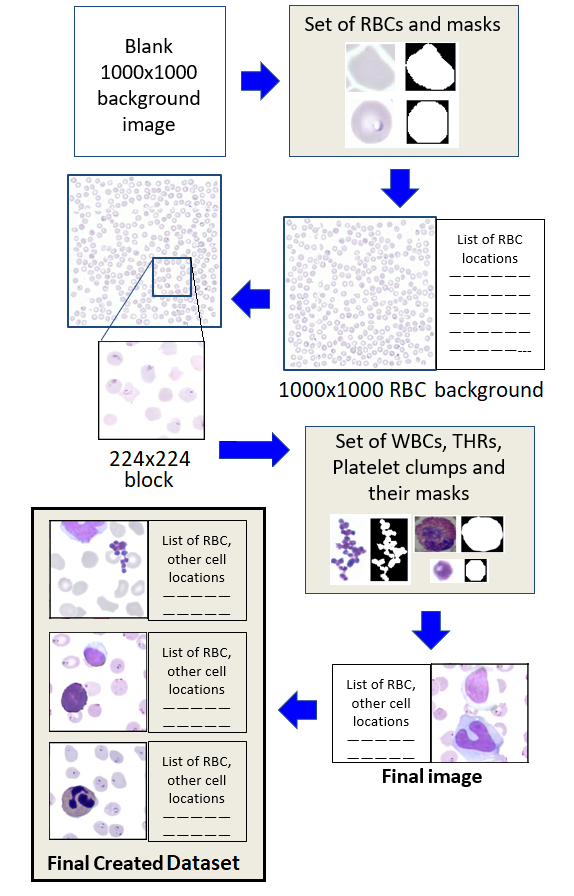
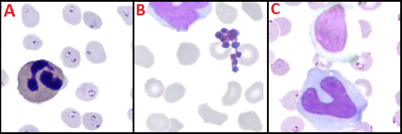
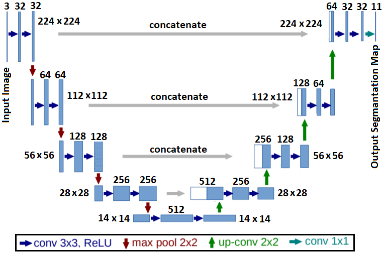
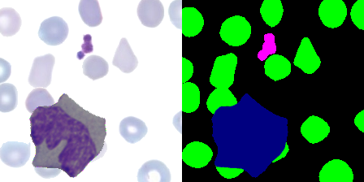
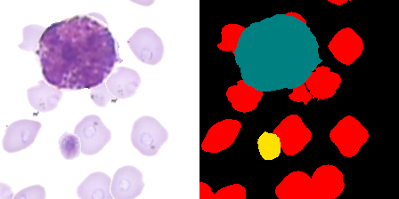
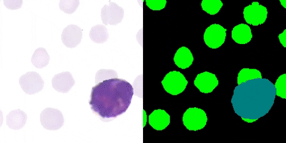

# Objective: 
Segmentation of different blood cells in a digitized blood smear image.

This project is to create a semantic segmentation map of digitized blood smear images containing different blood cells using a convolutional neural networks.
This is also done to get a hands on with segmentation networks.

The neural network used here is a modified version of the [U-Net](https://arxiv.org/abs/1505.04597) segmentation network. The pdf of the paper is also present [here](extra_files/Unet.pdf).
This network takes in a **224 x 224** image as input. This is a simple RGB colored image obtained from a digital microscope showing the different blood cells in a blood smear on a slide at **40x** magnification.
The network produces an output image which is also **224 x 224** pixels in size and shows the different **Red Blood Cells (RBC)**, **White Blood Cells (WBC)**, and **Platelets or Thrombocytes (THR)** regions in different colors.
With enough training the neural network will be able to predict and color code the different regions of the input image with different colors thereby producing a semantic segmentation map of the input image.
The network has to be first trained using a training dataset and validated with a validation dataset. After that it has to tested on a completely unseen test dataset to check its performance.
The images in the dataset used here has the following types of cells: **2** types of RBCs: **Infected RBC** (RBCs infected with malarial parasite), **Healthy RBC**; 
**5** types of WBCs: **Eosinophil**, **Basophil**, **Neutrophil**, **Lymphocytes**, and **Monocytes**; 
**2** types of Platelets: **Thrombocytes** (individual platelet cells) and **Platelet Clumps** (bunch of platelets appearing as a cluster).
So overall there are **9** objects and background, so **10** classes in the dataset. And in the output predicted segmentation map will have the following colors for the different objects.

* **1. Eosinophil**    `(color: cyan)`
* **2. Basophil**    `(color: teal)`
* **3. Neutrophil**    `(color: pink)`
* **4. Lymphocytes**    `(color: olive)`
* **5. Monocytes**    `(color: navy)`
* **6. Thrombocytes**    `(color: yellow)`
* **7. Platelet Clumps**    `(color: magenta)`
* **8. Infected RBC**    `(color: red)`
* **9. Healthy RBC**    `(color: green)`
* **10. background**    `(color: black)`

# Dataset Creation:
The images used for creating the training, testing and validation datasets are obtained from four different databases: 
* [**Leukocyte Images for Segmentation and Classification (LISC) database**](http://users.cecs.anu.edu.au/~hrezatofighi/publications.htm): This contains images of five types of WBCs on a background of RBCs. The images are labeled by the type of WBC in them, and each image also has a binary mask that indicates the pixels representing the WBC region.
* [**Isfahan University of Medical Science (IUMC) database**](https://misp.mui.ac.ir/fa): This has labeled images of individual WBCs with their binary masks. However, this database does not have Basophil images.
* [**MAMIC database**](http://fimm.webmicroscope.net/Research/Momic): It has large blood smear images of healthy RBCs, THRs, Platelet clumps and Malaria infected RBCs. Occasionally, WBCs also appear in the MAMIC images, but they are not labelled. Every image contains multiple cells, without any binary masks to separate them.
* [**KAGGLE database**](https://www.kaggle.com/iarunava/cell-images-for-detecting-malaria): This contains images of individual healthy and infected RBCs, but without any binary masks. All the Malarial infection images in the last two databases are with Plasmodium Falciparum pathogen.

The main reason to combine all these different databases is the unavailability of a single annotated database that contains all types of blood cells (mentioned earlier) along with malaria infected RBCs.

For a robust training of the CNN, the training dataset should have a wide variety of combinations of the different blood cells. 
For example, there should be images with an Eosinophil and a Basophil with healthy RBCs in the background, images with a Monocyte and Platelet clumps on a background containing both healthy and infected RBCs, images containing only Lymphocytes on a background of infected RBCs, etc. None of the databases mentioned earlier has this much variety. 
Additionally, total number of WBC images over all the databases is around **391**, which is not sufficient for a good training. Hence, a fresh dataset was created which has the desired variations, using images from the previously mentioned databases as building blocks.

As a first step, a set of images is created that has only one kind of cell in them along with their binary masks. This is done for the LISC, KAGGLE, and MAMIC images. IUMC images are already in this format. 
The region of WBCs in the LISC images are cropped off using their masks to create individual images of WBCs. LISC and IUMC provides all the required WBC samples. 
One set of infected and healthy RBCs are obtained from KAGGLE. THRs, Platelet clumps and another set of infected and healthy RBCs are cropped out manually from several MAMIC images. 
The binary masks of the samples obtained from KAGGLE and MAMIC are created using simple image thresholding technique. 
Finally, all these newly created samples are resized such that they are similar in size to cells seen under a microscope with **40x** magnification. Some of these final samples are shown in Fig.~\ref{fig:modified_images}. 
The total number of samples obtained in this manner for different cells is given below: 

| Cell Types | LISC | IUMC | MAMIC | KAGGLE |
|:----------:|:----:|:----:|:-----:|:------:|
| Eosinophil | 37 | 42 | - | - |
| Basophil | 50 | - | - | - |
| Neutrophil | 47 | 38 | - | - |
| Lymphocyte | 45 | 32 | - | - |
| Monocyte | 48 | 36 | - | - |
| Thrombocyte | - | - | 82 | - |
| Platelet clump | - | - | 36 | - |
| Infected RBC | - | - | 407 | 13779 |
| Healthy RBC | - | - | 3539 | 13779 |

**The following flowchart shows how the training, testing and validation datasets are created.**

First, all of the different types of image samples shown in the above table are separated into three groups namely: **training samples** (comprising **80%** of all the samples), **testing samples** (comprising **10%** of all the samples) and **validation samples** (comprising **10%** of all the samples). Only images from the training samples set are used to create the synthetic training dataset. Similarly, only images from the testing and validation samples sets are used to create the images for testing and validation datasets, respectively. This is done so that there are no common samples between the three datasets created and the neural networks never see any testing samples during training.

The size of the images in these datasets are **224 x 224** pixels. At first, some **1000 x 1000** background images are created that contain only RBCs in them. This is done by affixing randomly selected RBC samples on a blank image at random places. These locations are also recorded in a separate list. Altogether, **1500** such background images are created. **500** of these have only infected RBCs, **500** have only healthy RBCs, and **500** have a mix of both. Then, **224 x 224** blocks are cropped out of these images from random locations and WBC, THR and Platelet clump samples are affixed in them randomly. For each such image, the class names of the objects and the position and size of their bounding boxes are recorded in a separate list. The samples are also rotated at random angles while affixing them. 3 sample images obtained are shown in following figure.

The total number of images in the final training, testing and validation sets are **65350**, **6560**, and **6560** respectively. All possible combinations of cells are present in among these images. 

But the datasets being too big are not added to this github repository. Some sample images are given in the [trial/images](trial/images) folder. Each of these images has a json file associated with them which contains the details of the objects present in the image along with the dimensions of the bounding box for that object. These are given in the [trial/labels](trial/labels) folder. Ground truth segmentation maps of the images are given in the [trial/segments](trial/segments) folder.

# Current Framework: 
* Tensorflow 1.7.0 (with GPU preferred). 
* Opencv libraries, Ubuntu 16.04, Python 3.6.3 (Anaconda).
* This training does not necessarily needs GPUs, but they will make it much faster. This model is trained on one **NVIDIA P6000 Quadro GPU** in the [**Paperspace**](https://www.paperspace.com/) cloud platform.

# Modifications from original U-Net architecture:
The [U-Net](extra_files/Unet.pdf) model is one of the most widely known model used for semantic segmentation task. It was used by the authors for cell segmentation in light microscopy images.

In this work, we use a modified version of the U-Net for creating segmentation maps for each input image. The original U-Net architecture is too big; hence, the depth of all the layers are reduced to half the original size. The height and width of the layers are also modified to handle **224 x 224** images as shown in above figure. This figure can be compared with the figure in the [original paper](extra_files/Unet.pdf) to observe the difference in the structure.
The other difference is that we have not used **valid** padding in the convolution layers as the original paper, we have used **same** padding instead for the ease of concatenation of the feature maps. 
Everything else in the model stays the same, and the final layer uses a softmax layer for every pixel of the output map. Basically every pixel of the output map is classified into one of the **10** classes in the datasset (as mentioned earlier).

# Training with weights:
Since the output of this segmentation network will be a segmented map of the input image, so the classification is done on the pixel level. Hence, here to make a good overall training performance, the dataset has to be balanced in terms of the number of pixels of the different classes in the dataset. I.e. the total number of pixels in each of the **10** different classes in the dataset has to be pretty much the same to have an unbiased training. Otherwise the network will only focus on performing well for the class that has the most number of pixels, because reducing the classification error for that class will reduce the overall error by the maximum amount since such pixels are the majority in number.

But since all the objects have different sizes, it is not possible to ensure that all the classes have pretty much the same number of pixels. Hence, while calculating the error during training, weights are used to make every type of pixel contribute similarly to the overall error. This is done by using a weight map along with the ground truth segmentation map for each input image during training. The weight map is also a **224 x 224** image but here each of the pixels represent a value that gives the weight to be applied to the classification error for that corresponding pixel in the ground truth segmentation map. These weight maps are created on the fly while training.

# Scripts and their Functions:
* [**utils_2.py**](codes/utils_2.py): All important functions for creating batches, creating the dataset etc. along with some extra functions are defined here.
* [**unet_model_6.py**](codes/unet_model_6.py): The model along with its associated functions are defined here.
* [**unet_training_2.py**](codes/unet_training_2.py): The training process is started using this script.
* [**unet_testing_2_modified.py**](codes/unet_testing_2_modified.py): Evaluates the output on fresh images one by one.

# Data Preprocessing, Hyperarameter and a short description of Training:
**[NOTE] All these settings are specified in the [utils_2.py](codes/utils_2.py) file.**
* Images are all resized into **224 x 224 x 3** size before feeding into the network.
* **Batch size: 100**
* **Epochs: 35**
* **Learning rate: 0.001 (upto epoch 1 - 5), 0.0001 (epoch 6 - 35)**. 
* A record of the **latest maximum validation accuracy** is also kept separately in a variable.
* The trained neural network model is saved if the validation accuracy in the current epoch is **better** than the latest maximum validation accuracy. 

A **json** file is also saved along with the checkpoint, which contains the following details: 
* Epoch, Batch size and Learning rate.
* Mean and Standard deviation of the training set.
* Latest maximum validation accuracy and minimum validation error.
* A statistics of the epoch, learning rate, training loss, training accuracy and validation accuracy upto the current epoch.

These information from this json file are reloaded into the model to restart the training, in case the training process got stopped or interrupted because of any reason.

# Results:
### The final pixel level accuracies of the model are as follows:

| Training Accuracy | Validation Accuracy | Testing Accuracy |
|:-----------------:|:-------------------:|:----------------:|
| 95.62 % | 95.37 % | 94.48 % |

### Some example predicted input images and segmentation map from the network:

Monocyte and Platelet Clump on a background of healthy RBCs. **Left:** Input image; **Right:** Predicted segmentation map.

Basophil and Thrombocyte on a background of infected RBCs. **Left:** Input image; **Right:** Predicted segmentation map.

# Observations and Discussions:

### An overall look of the images with the superimposed heat maps is shown below.

The video of this detection can also be found on [Youtube](https://www.youtube.com/) at this [link](https://www.youtube.com/watch?v=iXx_U7ga3FU&feature=youtu.be).

