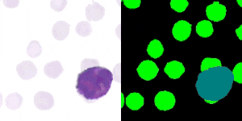

# Objective: 
Segmentation of different blood cells in a digitized blood smear image.

**A *Trailer* of Final Result:**

[**YouTube Link**](https://www.youtube.com/watch?v=iXx_U7ga3FU&feature=youtu.be)

---

This project is to create a semantic segmentation map of digitized blood smear images containing different blood cells using a convolutional neural networks.
This is also done to get a hands on with segmentation networks.

The neural network used here is a modified version of the [U-Net](https://arxiv.org/abs/1505.04597) segmentation network. The pdf of the paper is also present [here](extra_files/Unet.pdf).
This network takes in a **224 x 224** image as input. This is a simple RGB colored image obtained from a digital microscope showing the different blood cells in a blood smear on a slide at **40x** magnification.
The network produces an output image which is also **224 x 224** pixels in size and shows the different **Red Blood Cells (RBC)**, **White Blood Cells (WBC)**, and **Platelets or Thrombocytes (THR)** regions in different colors.
With enough training the neural network will be able to predict and color code the different regions of the input image with different colors thereby producing a semantic segmentation map of the input image.
The network has to be first trained using a training dataset and validated with a validation dataset. After that it has to tested on a completely unseen test dataset to check its performance.
The images in the dataset used here has the following types of cells: **2** types of RBCs: **Infected RBC** (RBCs infected with malarial parasite), **Healthy RBC**; 
